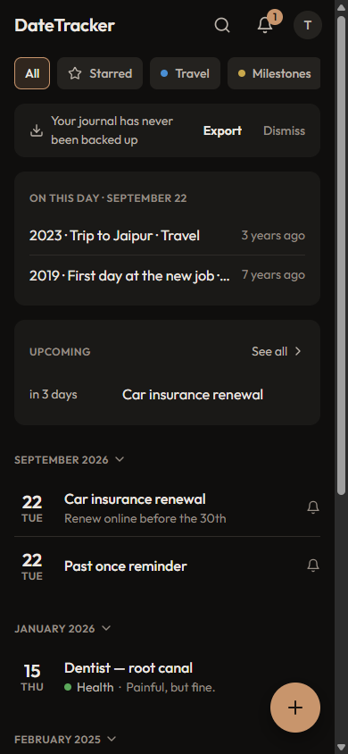
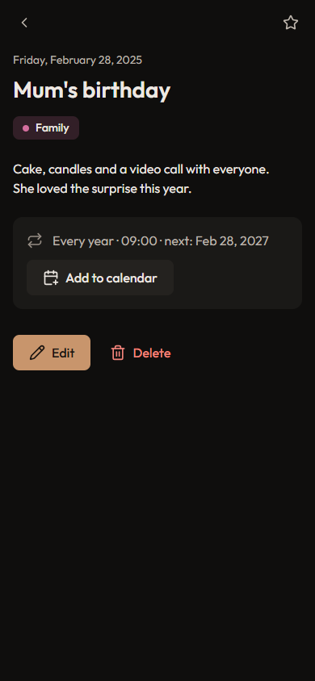

# DateTracker

A private journal of memorable events — trips, purchases, milestones, health episodes, conversations. Record what happened and when, look back with **On This Day**, and get reminders for renewals and anniversaries.

**Live app → [anshulsamarwal2.github.io/DateTracker](https://anshulsamarwal2.github.io/DateTracker/)**

It is a log, not a to-do list or a habit tracker.

<p>
  
  
</p>

## Features

- **Timeline** of memories grouped by month, newest first, with search, a star filter and category filters.
- **On This Day**: memories from the same date in earlier years.
- **Reminders**, once or every year, with a Reminders screen and **Add to calendar** (`.ics`) so your calendar app can alert you.
- **Trash** with Undo. Nothing is deleted until you empty it.
- **Categories** with colours and your own order.
- **Export** JSON (full backup) or CSV; **import** JSON backups or any CSV (merge only — nothing is ever replaced).
- **Works offline** and **installs** as an app. Changes sync live across your devices.
- Light, dark or system theme, with a choice of accent colour.

## Privacy

No analytics, no ads, no tracking. Your journal is stored in Firestore under your Google account's user id, and Firestore rules allow only you to read or write it. Theme and accent are stored on your device only.

## Run locally

ES modules don't load from `file://`, so use the bundled static server (Node 20+):

```bash
npm install      # only needed for tests
npm run serve    # http://localhost:8080/
npm test         # unit tests (Vitest)
```

`localhost` is an authorised Firebase domain by default, so Google sign-in works. The service worker is not registered on `localhost` unless you add `?sw=1`.

## Deploy your own copy

1. **Firebase:** create a project, add a Firestore database, enable **Authentication → Google**, and register a web app.
2. **Config:** put your web app's config in `src/config.js` — the only file you need to edit.
3. **Rules:** paste `firestore.rules` into Firestore → Rules and publish.
4. **Authorised domains:** add your host (e.g. `yourname.github.io`) under Authentication → Settings → Authorised domains.
5. **Host:** any static host works. For GitHub Pages: Settings → Pages → Deploy from branch → `main` / root.

About the API key in `src/config.js`: a Firebase *web* API key is not a secret. It only identifies your project to Google. Access to data is controlled by the Firestore rules (only the signed-in owner can read or write their documents) and by the list of authorised domains for sign-in.

Sign-in inside an installed app uses a popup; if a browser blocks popups it falls back to a redirect, which only works reliably when `authDomain` is on the same site as the app — to guarantee it, serve the app from Firebase Hosting or set `authDomain` to your own domain and proxy `/__/auth/*` ([redirect best practices](https://firebase.google.com/docs/auth/web/redirect-best-practices)).

When you deploy a change, bump `VERSION` in `sw.js` so installed copies pick up the new files ("Update ready · Reload").

## How it's built

Plain HTML, CSS and native ES modules — no bundler, no framework, no build step. `npm` is only used for tests.

```
index.html            app shell (inline icon sprite)
sw.js                 offline cache
manifest.webmanifest  PWA manifest
styles/               tokens, base, components, screens
src/
  main.js             boot: theme → auth → first run → live sync → screens
  config.js           Firebase config
  firebase.js         SDK init (only this and db.js import Firebase)
  db.js               all Firestore reads and writes
  store.js            app state
  selectors.js        derived views (timeline groups, on this day, upcoming…)
  model.js dates.js reminders.js router.js theme.js notifications.js
  io/                 CSV, import, export
  ui/                 screens and components
vendor/firebase/      Firebase JS SDK 10.12.2 (ESM, vendored for offline use)
tests/                Vitest unit tests
```

Scripts: `scripts/vendor-firebase.sh` (refresh the SDK), `scripts/make-sprite.mjs` (rebuild the icon sprite), `scripts/make-app-icons.ps1` (rebuild PNG icons).

## Data model

```
users/{uid}/entries/{id}      title, date ('YYYY-MM-DD', local), notes, categoryId|null, starred,
                              reminder: null | {kind:'once', at:'YYYY-MM-DDTHH:MM'} | {kind:'yearly', time:'HH:MM'},
                              deletedAt|null, createdAt, updatedAt
users/{uid}/categories/{id}   name, color '#RRGGBB', order, createdAt
users/{uid}/meta/app          schemaVersion: 2, createdAt, lastBackupAt, backupNudgeDismissedAt
```

## About notifications

A free web app without a server can't wake itself up at a set time. DateTracker shows a notification when a reminder is due while the app is open (or opened later that day), and the bell and Upcoming card show what's coming. For alerts you can rely on, use **Add to calendar** on a memory.

## Credits & licences

Built by Anshul Samarwal, designed and developed with [Claude](https://claude.ai) by Anthropic.
Icons: [Lucide](https://lucide.dev) (ISC). Typeface: [Outfit](https://fonts.google.com/specimen/Outfit) (SIL Open Font License 1.1).

Personal project. Not licensed for redistribution or commercial use.

Version history: [CHANGELOG.md](CHANGELOG.md). The previous single-file app is at the `v8.2-legacy` tag.
